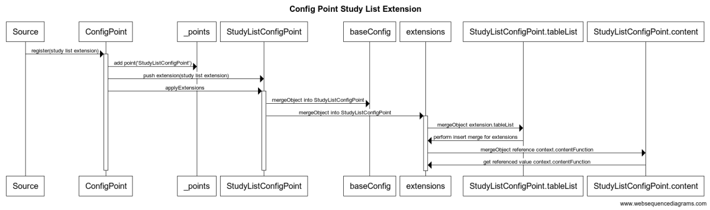
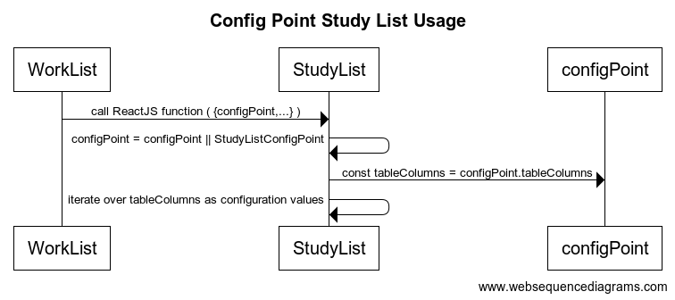

# ConfigPoint
A declarative configuration library, where configuration points can be defined, and then later extended to provide customizations for users.

This project is now based at [OHIF](https://github.com/OHIF/config-point.git) as the primary source rather than as a
a personal project from the wayfarer3130 project, and updates will now come from the OHIF repository.

## Overview
`ConfigPoint` is a library that allows script declarations of configuration values
to be modified on demand in a declarative fashion by dynamically loading addtional
configuration files.

The script declaration can be simple static content, for example:
```
const ModalitiesList = ConfigPoint.register({
  ModalitiesList: [
    {id:'MR', name: 'MR', description: 'Magnetic Resonance'},
    {id:'CT', name: 'CT', description: 'Computed Tomography'},
  ],
});
```

or it can be a combination of functional and declarative elements, for example a ReactJS function could be declared:

```
const DisplayModalities = ConfigPoint.register({
  Modalities: {
    ModalitiesList: [
      {id:'MR', name: 'MR', description: 'Magnetic Resonance', component: props => (<li>MR</li>)},
      {id:'CT', name: 'CT', description: 'Computed Tomography', component: props => (<li>{props.translation['CT']</li>)})},
    ],
    displayList: props => (
      <ol>${ConfigPoint.Modalities.ModalitiesList.forEach(item => component(props))}</ol>
    ),
})
```

The function declarations can only be declared in script declarations, as they are compiled components.  However, there isn't any reason that the over-ride can't inherit existing script declarations by referring to them.

The remaining sections go through the declarative design for ConfigPoint, followed by the JSON5 configuration files, and then how to make specific types of changes in configuration files.

## Script Declaration of Settings
(TODO) 

## Dynamic Configuration Loader
There is a dynamic configuration loader that examines the URL parameters and loads all of the named configuration files.  In order to do this reasonably securely, a path prefix is provided for the configuration elements, and only simple names for configuration files are permitted.

A typical use of this might be:
```
  if (window) {
    // Make the config point accessible in the window
    window.ConfigPoint = ConfigPoint;
    // Load the default theme settings
    const defaultTheme = 'theme';
    const themeBasePath = '/theme';
    const themeUrlParameter = 'theme';
    ConfigPoint.load(defaultTheme, themeBasePath, themeUrlParameter);
  }
```
where the ConfigPoint.load method is called with the default theme, the URL prefix for all themes, and the URL parameter value.  In this case, the default theme is named theme, and is found in a file theme.json5.  The path for that is the relative path /theme, and the parameter on the URL is theme.  

The load function returns a promise when all the themes are loaded.  This is also available as `ConfigPoint.loadPromise`
for use when the themes need to have been loaded before proceeding, but are disconnected from the actual load declaration.

The theme files are JSON5 encoded, the advantages of which are:
* Comments are permitted in JSON5
* Keywords can be used on the left hand side instead of strings, eg  `myValue: 'a value'` 
* Trailing commas are permitted

## Customizing Existing Settings
(TODO - this is out of date.

### Extending API
An extension to a ConfigPoint is just an additional declaration, but assigning
the value to extension instead of configBase.  Note that extensions can be added
before or after the ConfigPoint itself is declared, but that the order of the
extensions may matter, as each extension modifies the previously applied values.

An example extension, showing a list modification, plus a reference value
modification is shown below.  Note the this contains a simple over-ride
value that sets the default column width to '12ex', as well as a more
complex list insertion that inserts someting at position 4, and that
assigns the value content from a reference instance tooltipClipboardFunction,
which is discovered in the 'context' for the config point being declared.
The referenced values allow assigning fixed
```js
ConfigPoint.register([{
    // Creates the config point StudyListConfigPoint
    configName: 'StudyListConfigPoint',
    // The base configuration is PatientListConfigPoint, so this declaration
    // declares AND extends StudyListConfigPoint
    configBase: 'PatientListConfigPoint',
    // And then modify the extension point
    extension: {
      // Modify the tableColumns list
      defaultColumnWidth: '12ex',
      tableColumns: [
        {
          _extendOp: 'insert',
          position:4,
          value: {
            key: 'description',
            // This is a way to reference an exsiting function, as long
            // as it is available in the context.  This may still change TBD
            content: { _reference: 'tooltipClipboardFunction' },
            gridCol: 4,
          }
        },
        ...
  ```



##### Delete
A delete operation can be done either by index, or by value name.  Either a single item
or an item within a list can be deleted.
```js
toBeDeleted: DeleteOp.create(1)
list: [DeleteOp.at(1)]
```

##### Replace
Replacing an item within a list can be done either simple value replacement, or by reference a list item position, 
for example:
```js
toBeReplaced: "new value",
list: [null,'new value at posn 1'],
list: {1: 'new value'},
```

#### Sorted Lists and Indexed keys
Instead of referencing simple list values, the ability to create a sorted list
from a set of objects is quite useful.  This allows directly applying values to
named sets, instead of having to know about positional values.  For example:
```js
      const srcObject = { three: { value: 3, priority: 1 }, two: { value: 2, priority: 2 }, one: { value: 1, priority: 3 } };
      const configBase = {
        srcObject,
        sortObject: SortOp.createSort('srcObject', 'priority'),
      };
      ... register config
      {
          testConfigPoint2: {
            configBase: CONFIG_NAME,
            srcObject: { srcFour, three: { priority: 4 }, two: { priority: null } }     
```
This will move the item three, add srcFour to the list, and remove item two (priority null).

#### Reference and Transform Objects
It is possible to reference another object within the current context root, or the general ConfigPoint object.
The timing of this is done at the time the config point configuration is generated, so the ordering of adding
extensions is, unfortunately, important.
To reference another part of the same config point, and then transform it with the given transform function, use
the following javascript - this will work in JSON provided the transform isn't present.)  
```js
{ configOperation: 'reference', reference: 'itemSrc', transform: transformFunction },
```

To reference another ConfigPoint, use the syntax below.  Note that the object will be the literal reference object, so
it will be affected by future updates.
```js
{ configOperation: 'reference', source: 'BrainLabellingData' },
```

### Usage API
The actual usage of the API is quite simple, a value is declared based on a
registration request, and then is simply used as a straight/simple value.  This
can occur as a ReactJS props argument, or directly in other code such as service
code.  When used as a props argument, the recommended usage is to get the value
and then default to a declared instance.  For example:
```js
const {MyConfigPoint} = ConfigPoint.register([....]);

const myReactFunction = ({configPoint,...}) => {
  // Set a default value if one isn't provided by the parent application
  configPoint = configPoint || MyConfigPoint;
  // Setup the config point for a child function - note this one is a member
  // value of the parent config point, but it could just as easily have been
  // based on an effect/setting elsewhere.
  const {childConfigPoint} = configPoint;
  // Use the config point to determine values directly
  return (<td style=`width:${configPoint.colWidth}`>
     // And have the config point itself contain the choice of what config point
     // a child should use
     {childConfigPoint.reactFunction({configPoint:childConfigPoint})}
     </td>);
```

A more direct naming declaration works as:
```js
const {MyConfigPoint} = ConfigPoint.register({
  MyConfigPoint: { configBase: { ... base configuration }
     ...extension configuration
  }
});

```



Note how in the above usage, there isn't anything that is actualy ConfigPoint
api specific - it could have been an arbitrary bag of values provided
to the child element, it just happens to be useful to declare it this way
to allow future extensions.  In fact, if the react function is entirely
ignorant of the config point, but has a set of properties around how it is
displayed, then those values can just directly be applied to the child creation.

### Future
Consider just extracting config point service into it's own library.  There
isn't anything OHIF specific about it, and it would be perfectly possible to
use it for other projects/areas.

Should the config points deliver promises rather than direct values?  That would
allow loading values from settings values, and would allow updates to anyone
listening for a config point when the value had finished loading.

#### Theme and Service Selection Loader
One type of theme implementation could be a theme loader that, on startup
loads a provided set of theme values into the ConfigPoint service.  These can
be simple JSON files, which are deployed with the application, for example,
a dark theme could be provided as /theme/dark.json, while a large font theme
might be provided as /theme/large.json.  Then, the user might specify:
https://myapp?theme=dark,large
and this would display the application in the dark and the large themes.
The system would know it was safe to load because the JSON files were vetted
and provided from, for example:
/public/theme/theme.json
/public/theme/dark.json

If the keyword and path are both specified by the using application, then this
can also be used to select from a service.  For example, service=google
or service=aws might load from the source files /public/service/aws.json, defining
how to connect to the AWS cloud services.

#### Self Documenting Configuration
It is additionally useful to allow the application configuration to self-document
the settings which can be modified.  This should document both the structure
of the values, as well as the permissions/safety of the values.  This can then
be used to validate whether user settings are safe to apply, as well as to guide
the user into what settings are available.

## Memory Layout
TODO

```js
```

## Storage in JSON files
The storage in JSON files is identical to that in the register operation,
except that JSON may not contain function declarations.  To alleviate this,
the reference operation is provided, to allow access to pre-declared functions
from within the JSON.

